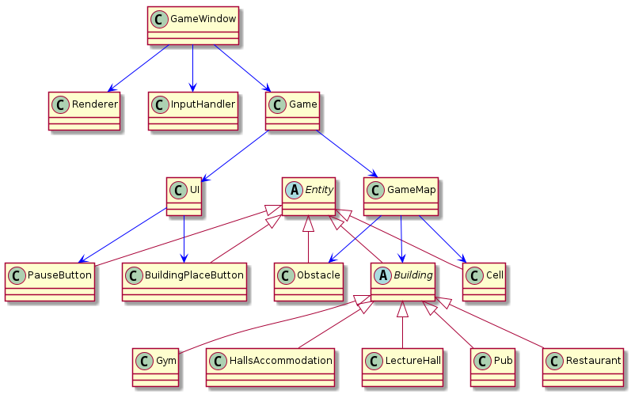
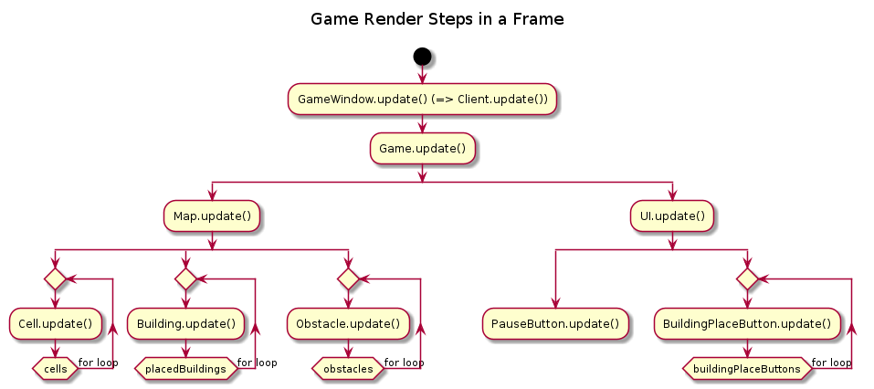
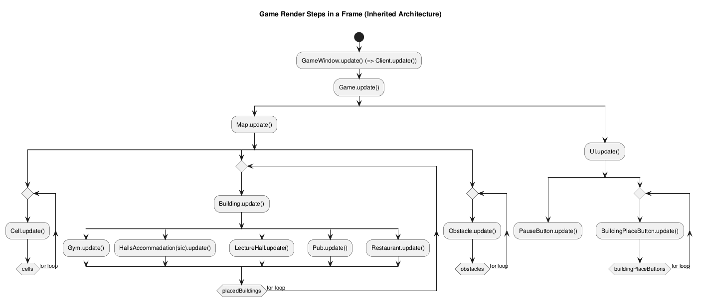
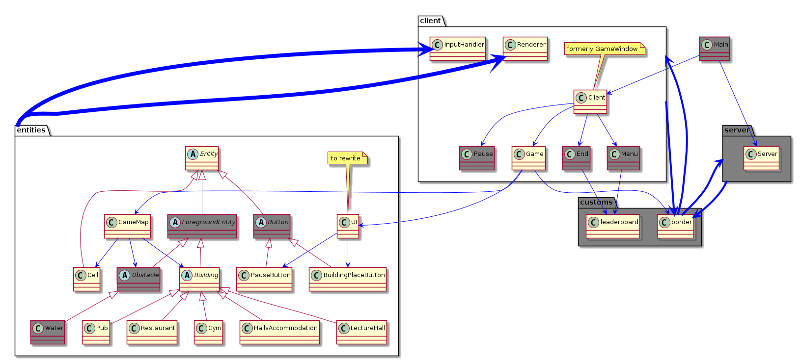
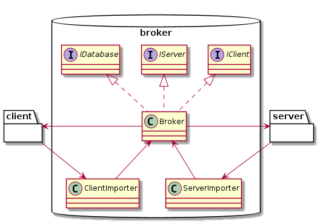
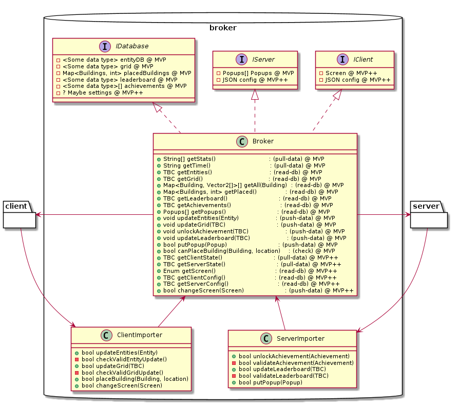
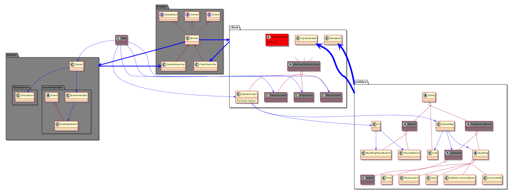
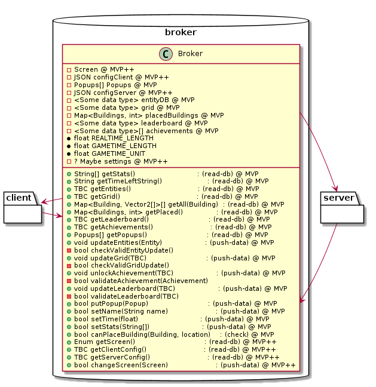

### Architecture 2

- David Lun
- Alex McBride
- Harry Muir
- Phyo Lin
- Sameer Minhas

**Note: Some of the previous groups architecture diagrams are missing due to the PDF conversion to an editable format, markdown for this instance. This is for clarity on why certain paragraphs mentioning diagrams are missing said paragraphs**

The above class diagram shows the planned architecture of our game. To create it, we used PlantUML, as it allows for the creation of diagrams that are easy to read, while clearly demonstrating the links and inheritance between all classes. PlantUML also allows for automatic refactoring of the diagram if and when changes are made to it, saving time.

The program itself will handle all inputs and rendering in the InputHandler and Renderer classes respectively. This allows for better simplicity when adding features to the game, such as buildings or UI elements, while also greatly reducing the amount of repeated code, which could otherwise make it harder to understand or modify. This flexibility will save on time and make necessary modifications easier to carry out.

Having all elements of the user interface as well as the buildings and map being subclasses of the Entity class will also make the rendering process simpler, as checks will not need to be carried out by the renderer object to ensure entities are rendered correctly. This is due to the fact that they all have a unique update method of the same name which will provide the renderer with the necessary information and instructions to draw said entities on-screen.

This also makes the rendering process quicker, thus carrying out the function NFR5_MINIMAL_LOADING Instead of having each cell containing information about the building placed on it, they will only contain their absolute position (based on the position of the top left cell that the building is placed on) on the map. Each building will instead contain its absolute location as well as a list of the cells it takes up. This will help with performance as the renderer will not have to iterate over every cell on the map, instead just the cells which have buildings placed on them.

The building architecture (the Building class and its subclasses) will allow for new buildings to be implemented much more efficiently as new buildings that are similar to, or use the functionality of, pre-existing building classes can inherit the functionality from those classes. This will also allow for greater consistency in implementation, which will make bug fixing easier.

The above state diagram shows the game’s building placement process. It demonstrates the kind of feedback the user will receive based on their inputs when interacting with the placement process, such as the warning message if they try to place a building on top of another building or outside of the map. It also allows the user to deselect a building in the event of a misclick or change in decision.

The above process will carry out requirements UR1_CAMPUS_CONSTRUCTION, UR12_BUILDING_RESTRICTIONS, FR6_BUILDING_SELECTION, FR7_BUILDING_PLACE, FR11_BUILDING_RESTRICTIONS and NFR9_BUILDING_RESTRICTION. It will not however carry out any requirements that allow the user to move or delete buildings, these will need separate processes which may also use methods and functionality implemented in the building placement system. It will need to increment the building counter, which will partially fulfil the requirement FR8_BUILDING_COUNT.

The state diagram shown above demonstrates the building removal process. The user will be given an alert should they select a cell that does not contain a building, allowing them to select a tile which does contain a building in the event of a misclick. Should the user select a cell that does contain a building, the building will be removed from the map and will no longer be displayed.

This process will fulfil requirements UR13_REMOVE_BUILDINGS and FR15_REMOVE_BUILDINGS. Its functionality may also be used when the player wishes to move a building. It will also need to be able to update the building counter to keep track of the number of buildings on the map, which will complete the requirement FR8_BUILDING_COUNT.

The above state diagram displays the building moving process. If the user selects a cell during the initial building selection stage then a warning message will be shown, alerting the user that they have selected an invalid cell. If the user selects an invalid cell during the placing stage then a warning message will alert the user that they cannot place the building there.

The PlaceBuilding and RemoveBuilding states will use the building placement and removal functionalities exactly as stated earlier. This will reduce code duplication and improve code readability, making it easier to bug test. This will also mean that any necessary changes to placement or removal due to the introduction of new features and/or pre-placed obstacles will only need to be made once. This functionality completes requirements UR8_MOVE_BUILDINGS and FR10_MOVE_BUILDINGS, along with the requirements already carried out by the placement and removal systems.

The above sequence diagram shows the building placement verification system that will check if the selected placement coordinates are valid. The user will select a building and position on the grid which will be passed to the GameMap. These will be passed into a GameMap method called getCanPlace(), which will be implemented to ensure that the selected building will not be outside of the map boundaries, and will also check that no previously placed buildings will intersect with it.

A loop will be used to iterate through all buildings that have been placed on the map and will check each one individually for a potential intersection. This loop will continue until either all buildings have been checked, or an intersection has been identified. Should a building’s placement be invalid, the method will return false, which will then be passed to the player in the form of an alert, both audio and visual, thus completing UR11_SOUND_EFFECTS and FR14_SOUND_EFFECTS. This deviated from the original design as it was intended to just be visual. This change occurred as we wanted to give other modes of feedback that were helpful to everyone, including the visually impaired. Otherwise it will return true and the building details will be passed up to the renderer to be displayed on-screen.

The above diagram shows the building removal process that will ensure that the user has selected a cell containing a building and then pop it from the list of buildings. The user will select a cell on the GameMap, the position of which will be passed into the removeBuilding() method, which will run the checks to ensure that the user has indeed selected a building. The method will iterate through the list of buildings until it finds one that contains the cell selected by the player. The building located on this cell will then be removed from the buildings list and will no longer be rendered. If the method does not find a building that contains the chosen cell, it will raise an error that will result in a warning message and a negative audio cue displayed to the player, alerting them that the cell they selected does not contain a building.

The image displayed above depicts one suggested method of how to implement buildings. The area taken up by a building would be indicated using an array of “rectangles”, where the array would contain each rectangle’s length and width, as well as its relative x and y position from a given anchor point. So, for instance, an L-shaped building would require two rectangles, one for the horizontal and the other for the vertical. Intersections between buildings would be determined by checking if any rectangles from one building intersect with those of the other. The advantage of this method is that it allows for buildings to take up a much larger number of cells without having to list all cells used (for example: a building with an area of 20 cells would be much easier to implement with this method than to list each cell individually). The disadvantage of this method is that it will require much more complicated calculations to determine intersections which could hinder the game’s performance when there are a large number of buildings. It would also only be of use if buildings took up large numbers of cells, which will not be the case in our final design.

Another design idea that was considered but ultimately scrapped was implementing the map as a 2D array, with its methods as methods of the Game class instead. To access a particular cell, the Game object would check the 2D array using the coordinates specified in the selected Cell object. The advantage of this method is that it would require less callback functions (as everything could be handled within the Game class), which could make this part of the code easier to understand. The disadvantage however, is that the Game file would become cluttered with the extra methods which could negatively impact code readability.

### Changes to previous groups architecture

After taking over the project we realised that a Plantuml diagram for the architecture was missing so Harry quickly wrote one up to reflect what it looked like.

After looking through the code, the Harry wrote a UML diagram for the renderchain it carries out. This represents a sprawl of all the classes flowing down and calling themselves and their childen.

Simple Version

Full Version

After some time, the architecture changed significantly from the original. Given the scope of the architecture some inticate diagrams were needed.

When figuring out the different ways of the classes interacting with each other, the arrows used have been color coded and unique from each other as well as other details to represent a certain detail.

- Red Arrows: Inheritance
- Blue Arrows: Instantiation
- Grey Boxes: New additions
- Thick Blue Arrows: Class talks to pointed destination class or group of classes through other class interactions

Overhauled Architecture (without backend)

Overhauled Architecture

Harry decided that there wasn't a need to have a seperate Client side group of classes and so move all of its functionality into Main. This was due to the Clients main purpose being to manage 'screens' which manages the 'screens' that is Libgdxs way of handling rendering between Client and Main on a single instance of the Game as it required the constant calling of 'setScreen()' to pass data between the two.

For the requirement for the game to have achievements and scores there was a need to figure out a solution to how to store that given data so that it can be used in both the Client and Server.

Their solution was to have a 'broker' class which would be dealing out and storing the data between the two sides. It'll be the database for the game to the classes which don't have direct connections to one another. Originally it would be consistent of multiple subclasses which would be the importers for the data to the Server and Client as well as interfaces for defining database and some other classes.

Simple diagram of broker class interactions

Detailed diagram of broker class interactions

Brokers interaction with rest of architecture

But after some deciding, it was decided due to time constraints it was easier to contain all components in one large class. Despite the lack of elegance with this implementation, it cut the time of applying the more modular nature of the first drastically.

Revised broker class

Revised broker interaction with rest of architecture

