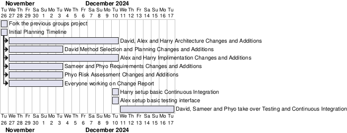

# Method Selection and Planning 2

#### Group No: Cohort 2, Group 7

#### Group Name: pickNmix

#### Group Members:

- David Lun
- Alex McBride
- Harry Muir
- Phyo Lin
- Sameer Minhas

#### Software Engineering Methods and Tools
Methods: The previous team adopted Agile methodologies to accommodate iterative development and constant feedback. Agile emphasises flexibility, collaboration, and regular communication, which suited the team’s structure and project scope. By breaking down the project into smaller tasks, assigning team members specific roles, and holding regular reviews, the team was able to adapt swiftly to changes, ensuring that all tasks met their deadlines while maintaining quality. They considered using the Waterfall model, which involves taking each section one by one as a group, (i.e. we would all work on requirements, then all on risk assessment etc), however they felt the approach would cause stagnation so they stuck with agile.  

This differs heavily to our groups programming approach where we adopted Paired Programming due to two of our members being the most well versed with programming, and when it comes to everything else including deliverables as well as with the introduction of Continuous Integration and Testing for this second part to the rest of the members. This ensures less issues and errors are leaked through to the final product due to the constant changing of observer (reviewer) and driver (programmer) roles between the two. 

Communication: The previous team used Instagram group chat for communication due to its accessibility and familiarity. This choice provided fast response times, vital for maintaining fluid communication during development. The team considered using Discord, a platform widely used for collaboration and file sharing, but as most members were more active on Instagram, this increased efficiency, especially because the file sharing aspect of Discord wasn’t needed due to our use of other software for file management. The use of Discord had its benefits though, such as the ability to have multiple different channels if we created a server, so we could keep all “requirements” stuff in a single tab, but the pure ease of creating an Instagram group chat deemed it simply more effective for us to create one of those instead. This is different from our team which uses Discord as our main method of communication due to most of us having it. We make use of its channels feature to seperate the development discussion from the general as oposed to needing to create new group chats for each different discussion.

File Management: Google Drive was used to organise files for each aspect of the project, including requirements, architecture, and risk assessments. The benefits of Google Drive over alternatives like Dropbox or OneDrive include:
Collaboration: Real-time file sharing and editing allow multiple users to work simultaneously, essential for Agile workflows.
- Organisation: Google Drive’s folder system provided structure, making it easy to access relevant project documents.
- Accessibility: Drive is accessible across multiple platforms, enabling team members to access files from any device. Other alternatives, such as Dropbox, do not offer as seamless collaborative editing tools as Google Docs does.
- Set up: We all already have access to Google Drive, and are all familiar with using the Google software, so it wouldn’t require us to learn how to use any software
- Tracking: On Google Drive and the related apps, you can see who updated things when and where, allowing us to keep track of which bits of work have been done by which people, to both show what works we did do, and point out what work others didn’t do Dropbox and OneDrive were both good alternatives that we considered using, especially OneDrive, due to it being a Microsoft program and so being well optimised to use the other Microsoft programs (mainly word), but due do the accessibility and ease of setting up and using Google Drive, we decided to go with the Google option for our project. 

In addition to Google Drive, due to specificities of some of our members prefered workflows, Github has been employed to deliverables where only one or two individuals are working on it at a time. This ensures:
- Convertability: These deliverables are written in markdown as to be viewable and edited easily. This format provides the benefit to be easily converted to HTML or PDF when finalised to be integrated well into the website at the end of the project. 
- Convinience: These deliverables will be stored on the code and website repositories which provides the benefit for the programmers to have the code and the deliverables in one location. This is also good for the Architecture and Method Selection and Planning deliverables due to their need to have access to the Plantuml graphs like the planning gantt chart and the architectural diagrams. This also includes the weekly snapshots which are needed on the website, so it skips the need to move the created snapshots from one place to another.

Game Development: Our team like like the previous team used libGDX, a Java-based game development framework, for the game’s development. It was selected due to its cross-platform support, specifically working across Windows and other operating systems. Unlike Unity or Unreal, libGDX is lightweight and designed specifically for Java developers, making it a better fit for the team's expertise. It also provides:
- Customizability: The framework offers low-level access to OpenGL for custom game rendering.
- Flexibility: It supports 2D and 3D development without the overhead of a heavy game engine like Unreal, which is more suited for large-scale, graphically intensive projects. Unity, while more user-friendly, adds extra overhead and licensing costs for certain features, which makes it less appealing, and also doesn’t natively support Java to program in. Unreal was considered too complex for the game’s needs and yet again doesn’t natively support Java, and JMonkey was discarded due to its steeper learning curve for those unfamiliar with it and focus on the development of 3D games. Website Hosting: The team hosted the project website on GitHub, taking advantage of GitHub Pages, which allows the hosting of static websites directly from a repository. The main benefits of GitHub for the team included:
- Version Control: Git allows team members to track changes, make commits, and use pull requests to propose modifications. This ensures that everyone works on the most updated version and reduces the risk of conflicting changes.
- Collaboration: A shared repository ensures all team members can contribute, view, or modify the website. Other free services like GitLab offer similar version control, but GitHub is more widely used, ensuring broader communit y support.

We considered using Netlify to host website, as Netlify has a lot of positives to it, such as automatic deployments from Git repos, a higher level of customization, and a global Content Delivery Network, allowing users from all around the world to be able to access it faster, but it also has a higher learning curve to implement things, and several limitations on the free tier, whereas GitHub would be completely free to use. As a result, we decided to use GitHub to host our website in the end.

Assets: In this stage of the project, we decided against using assets and to just use placeholder coloured tiles to represent each different tile or building, but we still considered which websites we would use when it came to using assets, and the main 2 were Itch.io and CraftPix.net. Itch.io has a decently large asset selection set, but that isn’t the website’s main purpose, and the licensing and allowed uses of the assets you get from the website are up to the control of the person who uploaded the assets, meaning that it’s different for each asset. CraftPix.net however is a dedicated 2D asset marketplace, so it has a much larger catalogue of available assets, and the licensing for them are done by CraftPix themselves, and unless specifically stated otherwise, includes royalty-free and non-exclusive licences, meaning for the case of our project, we wouldn’t need to worry about getting the licence to use the assets from CraftPix in our project.

IDEs: There were a lot of different IDEs which the previous team considered using for the project. The recommended IDE to use with LibGDX is Android Studio, however, due to none of them having ever used it, they decided against using it, and instead debated over whether to use VS Code or IntelliJ IDEA. VS Code was more lightweight and customizable, however it doesn’t natively support Java. IntelliJ IDEA however is designed for Java development and is at default a full featured IDE, and multiple members their team were already familiar with IntelliJ IDEA, so the decision seemed easy to make between which IDE they would use. Although you can use multiple different IDEs simultaneously and there won’t be any outright compatibility issues, they decided to all use the same IDEs to avoid any confusion and clashes with different Java versions or unavailable functions, and so they decided to use IntelliJ IDEA. 

Due to our groups vastly different systems and workflows, as well as the fact we chose Paired Programming as our approach we decided to stick to our chosen IDEs and text editors. These include the commonly used Vscode, Intellij as well as Neovim.

Testing: After some discussing our group decided to use JUnit as the testing framework that we will be using due to it being the most well supported with the use of extensions as well as documentation compared to alternatives.

#### Team Organization Approach
The previous team adopted a hierarchical structure with a designated leader, Jacob. His role involved making sure we don't get sidetracked and helping ensure meaningful progression. This leadership structure was effective for the team for several reasons such as acting as a central point of contact, distributing work and ensuring that no one was overwhelmed. In addition to appointing Jacob as the team leader, the roles were clearly divided to streamline the workflow and maximise efficiency. Each team member took responsibility for specific aspects of the project:
- For part two this is taken over by Phyo, Hasan and Isaac handled risk management, analysing potential project risks and preparing mitigation strategies. Their work was vital for ensuring that issues such as delays, technical hurdles, or resource limitations were anticipated early and addressed.
- Alex and Hasan were tasked with game architecture. They designed the underlying structure of the game, ensuring it was scalable, efficient, and adaptable for future changes. This task involved defining core components such as game logic, graphics systems, and input handling. With help from Alex and Harry appying the architecture changes, David will takeover the documentation for architecture.
- Huzaifa took charge of the website development and method selection and planning. He was responsible for hosting the project on GitHub and ensuring that it was easily accessible to the client and team. His role in method selection helped define the Agile approach that guided the team’s workflow. David will takeover the Method Selection and Planning deliverable and the website will be tweaked and worked on by different members for different parts.
- Sameer and Phyo will be taking over the requirements deliverable changes from Jacob and Joe worked on the previous teams requirements gathering, ensuring that all client expectations were clearly understood and documented. They translated the client's vision into concrete game features and deliverables. 

Parallel Development and Team Coordination: While each member focused on their individual roles, they worked in parallel to ensure that no time was wasted. For example, as Hasan and Isaac worked on risk management, the others progressed with their tasks. The deadlines were staggered to allow for dependencies, such as the architecture deadline preceding the start of the full implementation and as certain people members were free they helped with the others tasks. The team's approach was appropriate for both the project and team because it:

- Allowed each member to focus on their area of expertise, maximising output quality.
- Facilitated early detection of problems in risk management, enabling timely adjustments.
- Ensured smooth handoffs between phases, particularly between architecture and implementation. The team held two meetings per week to review progress, resolve challenges, and brainstorm improvements. These regular meetings were essential for:
- Transparency: Ensuring everyone was on the same page and that all aspects of the project were progressing in sync.
- Flexibility: Early identification of potential blockers allowed the team to shift priorities and adapt quickly. This organisation method was appropriate for both the project and team because it emphasised collaboration, task division, and continuous feedback, all of which were necessary for timely delivery.

When it comes to extra assigned deliverables and tasks needed for the second part:
- Testing will be an extra need for the implimentation and coding side of things and this will be taken over by whoever finishes their changes to their assigned deliverables given the scope of the project has increased.
- Continuous integration was implimentated by Alex and Harry on Github through its actions which allows easy integration with the game. Originally Sameer and David would be doing the deliverable for it but due to the small scale as well as starting work on it earlier Sameer took over completely.
- User evaluation report will be planned out by Phyo and carried out with the addition of Sameer.

### Weekly Planning

We used a gantt chart, built using Plantuml, to visually present our progress and timeline of what our responsibilities are when allocated.

Aside from weekly discussions as a group, notable developments include:
- Week 9: Members working on the deliverable changes have finished, discussing further jobs like Continuous Integration and testing until further information on the game is given by Alex and Harry in an in-person meeting as a whole group.
- Week 11: Testing interface and basic Continuous Integration setup by Alex and Harry, the rest of the members will be allocated on specific parts and writing up these respective deliverables with programmers continuing their work on the game.
- Winter Break: Some work and changes on the architecture and code have been done during this time, the most notable things done was there was a change to the original plans for the architecture we were planning on implimenting with inspiration from our previous architecture. This change is specifically on the 'client' or the front end being merged together with the Main class with libgdx functions and rendering.
- After Winter Break: Sameer will be taking over Continuous Integration deliverable, the rest of the members not including Alex and Harry who are doing the game project will be doing the testing on the functions that they provide as they continued on the game.
- Last couple days before deadline Phyo and Sameer carried out user evaluation after the game was complete.
